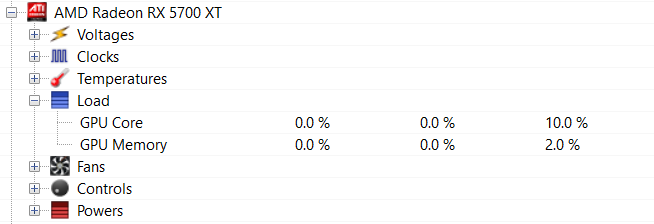

Rainmeter OpenHardwareMonitor Plugin
===============

This Plugin allowes Rainmeter measures to access the sensor data of [OpenHardwareMonitor](http://openhardwaremonitor.org)/[LibreHardwareMonitor](https://github.com/LibreHardwareMonitor/LibreHardwareMonitor). The data is fetched from WMI.

## Requirements

- [OpenHardwareMonitor](http://openhardwaremonitor.org) or [LibreHardwareMonitor](https://github.com/LibreHardwareMonitor/LibreHardwareMonitor) is running

## Install

1. Download the latest [Release](https://github.com/abichinger/Rainmeter-HardwareMonitor/releases)
2. Install the .rmskin file

## Measure

### Usage:

```ini
[Measure]  
Measure=Plugin  
Plugin=OpenHardwareMonitor.dll
;Namespace=LibreHardwareMonitor ;use LibreHardwareMonitor
HardwareType=Mainboard | SuperIO | CPU | GpuNvidia | GpuAti | TBalancer | Heatmaster | HDD | ...
HardwareName=HardwareName
HardwareIndex=HardwareIndex
SensorType=Voltage | Clock | Temperature | Load | Fan | Flow | Control | Level | ...
SensorName=SensorName
SensorIndex=SensorIndex
```

### Supported parameters

| Parameter | Description | Default |
| --- | --- | --- |
| Namespace | WMI namespace | `OpenHardwareMonitor` |
| HardwareType | type of hardware (types: [OHM](https://github.com/openhardwaremonitor/openhardwaremonitor/blob/master/Hardware/IHardware.cs)/[LHM](https://github.com/LibreHardwareMonitor/LibreHardwareMonitor/blob/master/LibreHardwareMonitorLib/Hardware/HardwareType.cs)) | empty string |
| HardwareName | name of hardware | empty string |
| HardwareIndex | index of hardware, if multiple devices match the supplied hardware filter | `0` |
| SensorType | type of sensor (types: [OHM](https://github.com/openhardwaremonitor/openhardwaremonitor/blob/master/Hardware/ISensor.cs)/[LHM](https://github.com/LibreHardwareMonitor/LibreHardwareMonitor/blob/master/LibreHardwareMonitorLib/Hardware/ISensor.cs)) | empty string |
| SensorName | name of sensor | empty string |
| SensorIndex | index of hardware, if multiple devices match the supplied filter | `0` |

each parameter is **optional**

### Examples ###



The following examples show how to measure the GPU Core Load 

```ini
[GPUCoreLoad]  
Measure=Plugin  
Plugin=OpenHardwareMonitor.dll
;Namespace=LibreHardwareMonitor ;use LibreHardwareMonitor
HardwareType=GpuAti
SensorType=Load
SensorName=GPU Core
MinValue=0  
MaxValue=100  

[GPUCoreLoadAlternative]  
Measure=Plugin  
Plugin=OpenHardwareMonitor.dll
;Namespace=LibreHardwareMonitor ;use LibreHardwareMonitor
HardwareName=AMD Radeon RX 5700 XT
SensorType=Load
SensorName=GPU Core
MinValue=0  
MaxValue=100  
```

More examples can be found inside the skin files [cpu.ini](Skins/CPU/cpu.ini) and [gpu.ini](Skins/GPU/gpu.ini).
